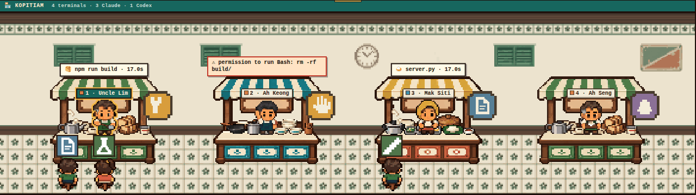
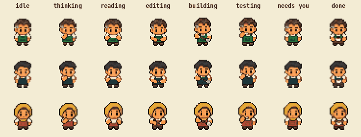
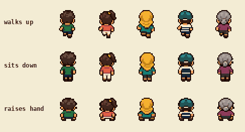
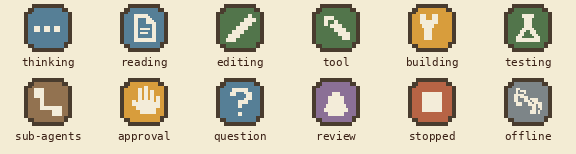
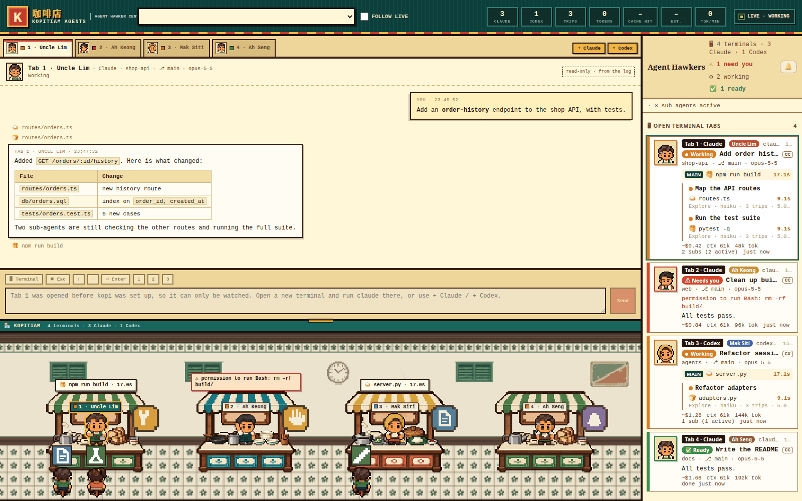

<div align="center">

# ☕ Kopitiam Agents · 咖啡店

**Your AI coding agents, run as a Malaysian hawker centre.**

Every open Claude Code or Codex terminal becomes a hawker at their own stall. Sub-agents are the customers.
Watch them all at a glance, read their conversations, and type into them from one page.



</div>

---

## Contents

- [Quick start](#quick-start)
- [The shop](#the-shop) · [hawkers](#hawkers--your-terminals) · [customers](#customers--sub-agents) · [badges](#status-badges)
- [The workspace](#the-workspace)
- [Talking to agents](#talking-to-agents)
- [How it works](#how-it-works)
- [Security & privacy](#security--privacy)
- [Art & credits](#art--credits) · [Project layout](#project-layout) · [Status & limits](#status--limits)

---

## Quick start

```bash
git clone https://github.com/hanzong111/Kopitiam_IDE.git
cd Kopitiam_IDE
python3 server.py                 # → open http://127.0.0.1:8787
```

That's it: no installs, Python standard library only. Every Claude Code / Codex terminal you already have open
walks into the shop straight away.

To **type into your agents from the page** (not just watch them), set up the `kopi` hook once:

```bash
python3 kopi.py install-shell     # then open a new terminal and run `claude` as usual
```

Or skip the hook and press **+ Claude / + Codex** in the page to start an agent in any folder: it runs with no
terminal window, and the page is its screen.

| Option | What it does |
|---|---|
| `python3 server.py --read-only` | watch only: never type into an agent |
| `python3 server.py --closed` | also list sessions from the last 24 h whose terminal is gone |
| `python3 server.py --port 9000` | serve on another port (default `8787`) |

**Requirements:** Linux · Python 3 · the `claude` and/or `codex` CLI installed and logged in.

---

## The shop

The bottom of the page is the kopitiam: four stalls in a row, **stall 1 on the left**. Drag the gold grip on its top
edge to make it bigger or smaller (it snaps to crisp zoom steps and remembers your choice; double-click resets).

| In the shop | In the agent world |
|---|---|
| a **hawker** at a stall | one open terminal tab (Claude Code or Codex) |
| the number on the stall's sign | the tab's number, kept for as long as the tab is open |
| a hawker **walking in** from the left | you opened a new terminal: they walk to the first free stall |
| a hawker **walking out** | the tab was closed: they pack up and leave, the stall frees up |
| what the hawker is doing | what the agent is doing right now (see below) |
| the **speech bubble** | the current tool call with a live timer, or why it needs you |
| steam from the kettle, heat under the wok | the agent is working |
| a **customer** on a stool | a sub-agent that tab has spawned |

### Hawkers = your terminals



Three hawkers take turns, one per stall: **Uncle Lim** at the kopi stall, **Ah Keong** at the noodle stall and
**Mak Siti** at the rice stall (tabs 4, 5, 6… reuse them as Ah Seng, Ravi, Kak Aisyah…).

| The agent is… | The hawker… | Badge |
|---|---|---|
| reading or searching files | reads the order | 📄 reading |
| fetching from the web | reads | 🔧 tool |
| editing or writing files | prepares food | ✏️ editing |
| running a build (`make`, `npm run build`, `cargo build`…) | cooks, with steam | 🔨 building |
| running tests (`pytest`, `npm test`, `go test`…) | tastes | 🧪 testing |
| running any other command or tool | prepares food | 🔧 tool |
| thinking / writing its reply | thinks | 💭 thinking |
| waiting on its sub-agents | waits | 🔗 sub-agents |
| **waiting for you** (a permission prompt or a question) | raises a hand | ✋ approval · ❓ question |
| **done: your turn** | holds out the finished dish | 🍽 review |

For open Claude Code terminals the status comes from Claude Code's own session files, so "needs you" and "done" are
exact. Codex publishes no status: its state is inferred from the log and marked **(guessed)** in its card.

### Customers = sub-agents



When an agent spawns a sub-agent, a customer **walks up from the bottom and sits on a stool** in front of that
agent's stall, facing the hawker. A small chip over their head shows what the sub-agent is doing (reading, editing,
testing…). When it finishes, the customer **stands up and leaves**, and the stool is free for the next one.

- Three stools per stall; extra sub-agents show as **+N sub-agents** and take a stool as one frees up.
- Five looks; each sub-agent keeps its look for life (even if it leaves and comes back to do more work).
- **Click a customer** to open that sub-agent's own conversation in the chat: the brief it was given, its tool calls
  and its replies (**← back to main** returns). The same list is under each tab's card in the sidebar.

### Status badges



With your system's **reduce motion** setting on, everyone holds a still pose and effects are off; badges and labels
stay, so nothing needs an animation to be noticed.

---

## The workspace



- **Agent tabs** across the top, one per open terminal, with the hawker's portrait.
- **The chat** shows that agent's conversation, read from its session log: your prompts, its replies (rendered as
  Markdown: tables, code, lists, links) and its tool calls.
- **Agent cards** on the right: status, current activity with a timer, project, branch, model, cost and context,
  plus a roster of its sub-agents. 🔔 turns on desktop notifications for "done" and "needs you".
- The top bar counts terminals, tool calls, tokens, cache hit rate, estimated cost and tokens per minute.

---

## Talking to agents

A web page can't type into a terminal window you opened yourself, so agents run under **kopi**: a transparent
pass-through (like `script` or asciinema). It looks and behaves exactly like running the agent directly: Ctrl-Z / `fg`,
resizing, mouse and scrollback all work as usual.

- **Send a message:** type in the box under the chat. **Enter** sends, **Shift+Enter** is a new line. The box is
  pinned to the selected agent and every agent keeps its own draft. Sending while it works is fine: the agent
  queues it.
- **🖥 Terminal** shows the agent's real screen, live, for approval prompts and menus. Click it and type, or use the
  **Esc ↑ ↓ Enter 1 2 3** buttons. It opens by itself when the agent needs you.
- **+ Claude / + Codex** start an agent in a folder you pick, with no terminal window. `kopi attach <pid>` (shown in
  the header) opens it in a real terminal too; **Ctrl-]** detaches and leaves it running.
- `claude -p …`, pipes and `--version` pass straight through kopi. Terminals opened **before** the hook can only be
  watched; to take over one, exit it and run `claude --continue` in a new terminal.
- `python3 kopi.py uninstall-shell` removes the hook.

---

## How it works

```
~/.claude/projects/*/<session>.jsonl  (+ subagents/agent-*.jsonl)   ┐
~/.codex/sessions/**/rollout-*.jsonl                                ┴→ adapters.py
      → one normalized event stream (SSE) → web/app.js → scene, chat, cards

~/.claude/sessions/<pid>.json + /proc   → fleet.py   → which terminals are open, and their status
kopi (pty pass-through) ⇄ ~/.kopitiam/sock/<pid>.sock ⇄ kopictl.py   → typing into agents, live screen
```

Every log line becomes one normalized event `{k, a, t, …}`: `k` is one of
`prompt · spawn · brief · tool · result · say · think · usage · done`, `a` is the agent (`main` or a sub-agent's
id), `t` is the time. The page knows nothing about Claude or Codex: to support another tool, write one adapter with
a `poll()` that returns these events.

Details worth knowing:

- **Tokens are counted once.** Claude Code repeats `usage` across the records of one reply; the adapter counts each
  message once.
- **A sub-agent is done** when it hands its report back, stops with `end_turn`, or goes quiet for 4 s after a
  text-only message. If it picks up new work afterwards, it is working again.
- **Prices are estimates** from `web/prices.json` (edit it; `~` marks assumed rows). On a subscription, read the $
  as "what this would cost on the API".

---

## Security & privacy

Session logs contain your prompts and tool output, and the page can type into your agents, so:

- the server binds to **127.0.0.1** and answers only requests addressed to localhost, whatever `--host` says
  (it rejects any other `Host` header, which also guards against DNS rebinding);
- every request that types or starts something needs the **per-run token** and a same-origin `Origin` header;
  `--read-only` turns all of it off;
- a message is **refused, not re-routed**, if its terminal closed or switched session;
- kopi's sockets (`~/.kopitiam/sock/`) are readable by your user only;
- rendered Markdown is **sanitized** (DOMPurify): no scripts, styles, forms, or remote images that could call out;
- nothing is ever written to your session logs.

---

## Art & credits

- **Kopitiam Mini Sprite Pack**: hawkers, stalls, props, effects, badges (`web/sprites/`). Its production plan and
  metadata (`manifest.json`, `state-map.json`) are included and drive clip timing, anchors and layer order.
- **Kopitiam Subagent Customers**: the five customers and the stool (`web/sprites/customers/`).
- **Bar background**: `web/sprites/room/bar.png`, a seamless 720×148 tile. Replace it with your own (148 px tall,
  repeats sideways) and reload.
- Vendored libraries in `web/vendor/`: [xterm.js](https://xtermjs.org) 5.5 (MIT), [marked](https://marked.js.org)
  18 (MIT), [DOMPurify](https://github.com/cure53/DOMPurify) 3 (Apache-2.0 / MPL-2.0).

---

## Project layout

```
server.py         HTTP + SSE server, static files, security checks
adapters.py       Claude Code / Codex session logs → normalized events
fleet.py          open terminals, per-session status, sub-agent roster
kopi.py           the pass-through wrapper, `kopi attach`, shell hook (install-shell / uninstall-shell)
kopictl.py        server side of kopi: find wrappers, type into them, stream their screen, start agents
web/index.html    page layout
web/app.js        event reducer, the shop renderer (hawkers, walking, customers), chat, cards
web/pixel.css     pixel-art skin and the shop scene
web/style.css     base layout
web/prices.json   editable price table
web/sprites/      sprite packs (atlases, stalls, customers, badges, bar background)
web/vendor/       xterm.js, marked, DOMPurify
docs/             README images
```

---

## Status & limits

- **Linux only** for now: open terminals are found through `/proc`.
- The **kitchen log / bill / ticket** panel is parked (hidden in `index.html`; the code is still there).
- Customers never raise a hand yet: Claude Code reports "needs you" per terminal, not per sub-agent, so the hawker
  raises it instead. The artwork is ready for when that information exists.
- Codex is single-agent here: its log has no sub-agent links.
